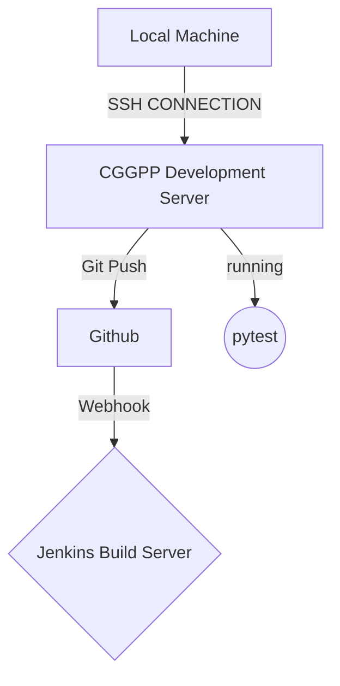

# QA Project Assignement 1 : 2021

# Project Brief

# The Chris Garner Guitar Pedal Project

My Godfather has a wonderful collection of classic guitar pedals that i thought would be suitible to show off in this project , unfortunatly this project has yet to reach the stage where it can show them off in all their glory !
This ReadMe will be updated as the project develops.

My Godfather is also a member of a band called Kytopia who i am currently mixing please check them out ! 

  
##  contents

 -  Approach 

- Architecture 
- Database Structure
- CI Pipeline 
- Project Tracking
- Risk Assessment
- Testing
- Front-End Design
- Known Issues
- Future Improvements
- Authors

## Database Structure

This Web application does not require a complex relational database Structure and could have been implemented with a different kind of database. for examinations sake i have included a bandmembers table although this will likely be removed after the examination of the project for future development. 

    _________________________________           _________________________________               
	|         **pedal**              |         |         **bandmember**          |
    |________________________________|         |_________________________________|
	|PK|id 		int 	 NOT NULL    |\        |  | first_name Varchar() NOT NULL|
	|  |model Varchar() 	 NOT NULL| \       |  | second_name Varchar()NOT NULL| 
	|  |effect Varchar()	 NOT NULL|  \-||-> |FK| model_id int         NOT NULL|
	|  |year_intro varchar()NOT NULL |         |_________________________________|
	|  |series Varchar() 	 NOT NULL|			
	|__|____________________________ |
   

## CI PipeLine

Github it seems does not support mermaid -_- will have to come back to this later

https://mermaid.ink/img/eyJjb2RlIjoiXG5cbmdyYXBoIFREXG5BW0xvY2FsIE1hY2hpbmVdIC0tIFNTSCBDT05ORUNUSU9OLS0-IEJbQ0dHUFAgRGV2ZWxvcG1lbnQgU2VydmVyXVxuRygoVHJlbGxvKSkgLS0-IEFcbkEgLS0-IEdcbkIgLS0gR2l0IFB1c2ggLS0-IEVbIEdpdGh1Yl1cbkUgLS0gV2ViaG9vayAtLT4gRHsgSmVua2lucyBCdWlsZCBTZXJ2ZXJ9XG5CIC0tIHJ1bm5pbmcgLS0-IEYoKHB5dGVzdCkpXG5cbiIsIm1lcm1haWQiOnsidGhlbWUiOiJkZWZhdWx0In0sInVwZGF0ZUVkaXRvciI6ZmFsc2V9

This Graph shows how my CI PipeLine was set up .
- Using the jenkins server to run pytest of its own accord has not been implemented yet.
- The purpose of the Jenkins Build Server should be to build a project and create an artifact at this stage of my training the process of depolying applications from artifacts has not been taught although it is in the spec . in this case the jenkins build server is acting as nothing other than a proof that the application builds.

## Project Tracking

This project was tracked using Trello 
use this link provided https://trello.com/b/2cnZEKK0/kanban-tickets

## Risk Assessment

I provided a risk assessment for this project , this was mostly for showing that there is next to no risk for this project 

## Front-End Design 

The Front end design is plain HTML Text to demonstrate the functionality that has been implemeneted 

## Known Issues

- The Forms seem to populate when different submit buttons are clicked 
- No Front end testing has been done 

## Future Improvements

- I will be redoing this project on the side using Golang as it is a tool that i am more comfortable with , This will also show QA that i can do these projects in languages other than python. 